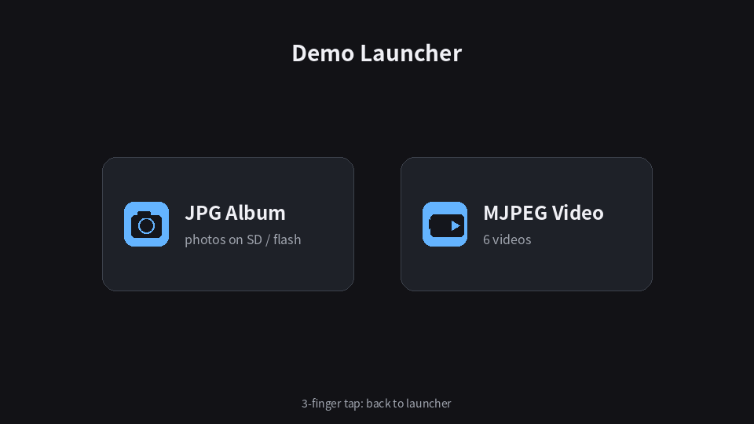

* [中文版](./README_CN.md)

---

<div align="center">

# 📷 Photo Album for Ameba RTL8721F (FreeRTOS)

</div>

[](https://freertos.org)
[](https://aiot.realmcu.com/en/latest/rtos/index.html)
[]()
[](LICENSE)
[](https://github.com/yangdavid988/photo-album/search?l=c)
[](https://lvgl.io)
[]()
[](https://gitee.com/yangdavid988/photo-album)

---
<div align="center">



</div>

---

🏞️ An electronic photo album on the **Ameba RTL8721F** (AmebaGreen2) SoC that shows JPEG photos and MJPEG video clips from a **microSD card** on an **800×480 TFT** panel over **LVGL 9.3**. Every pixel is produced by the **MJPEG hardware decoder** (Vivante GC/HX170) + **PP post-processor** — no CPU pixel work. Photos are decoded into PSRAM framebuffers and flipped by the **LCDC DMA** at the safe frame boundary; videos are decoded straight into the framebuffer the LCDC is *not* scanning, so playback never tears.

A launcher screen routes between two modes:
- **JPG Album** — browse photos (SD card first, flash C-array table as fallback), with swipe gestures, brightness control and a slideshow.
- **MJPEG Video** — play video clips (folders of sequentially-numbered JPEG frames) with tap-to-pause and brightness drag.

- 📄 [Chip & module info](https://aiot.realmcu.com/en/home.html) | 🌿 [Gitee mirror](https://gitee.com/yangdavid988/photo-album) | 🛒 [Board on Taobao](https://item.taobao.com/item.htm?id=1064116880996)


---

### 🛠️ Tech Stack

<p>
  
  
  
  
  
  
  
</p>

### 🔍 Topics & Keywords

<p>
  <a href="https://github.com/topics/embedded"></a>
  <a href="https://github.com/topics/iot"></a>
  <a href="https://github.com/topics/freertos"></a>
  <a href="https://github.com/topics/lvgl"></a>
  <a href="https://github.com/topics/realtek"></a>
  <a href="https://github.com/topics/photo-album"></a>
  <a href="https://github.com/topics/tft-display"></a>
  <a href="https://github.com/topics/embedded-video"></a>
</p>

---

### 🏗️ Project Structure

```
.
├── app_example/
│   ├── main/app_main.c             # boot + LVGL render loop (from mcu-pc-dashboard)
│   ├── core/jpeg_decode.c/.h       # MJPEG + PP hardware decode wrapper (+ persistent session)
│   ├── core/mjpeg_player.c/.h      # clip playback task: FB ping-pong, pacing, gestures
│   ├── core/brightness_osd.c/.h    # brightness pill drawn straight into an FB
│   ├── ui/launcher_ui.c/.h         # boot screen + photo/video mode router
│   ├── ui/album_ui.c/.h            # canvas + info bar + gestures + slideshow
│   ├── ui/mjpeg_picker_ui.c/.h     # multi-clip picker (paginated card grid)
│   ├── hal/lcd/                    # T1720A LCDC driver (from mcu-pc-dashboard)
│   ├── hal/touch/                  # GT911 (from mcu-pc-dashboard, + multi-finger chord detection)
│   ├── hal/backlight_ctrl.c        # TIM4 PWM backlight (from mcu-pc-dashboard)
│   ├── storage/album_sd.c/.h       # SD-card photo source (VFS + FatFS, hot-plug)
│   ├── storage/album_sd_video.c/.h # SD-card clip source (frame folders)
│   ├── assets/photos/              # ← generated photo tables (jpg2album.py)
│   ├── assets/icons/               # ← generated launcher icons (gen_launcher_icons.py)
│   └── config/                     # album tunables, LVGL override, threshold config
├── tools/jpg2album.py              # JPEG → C array generator (with --max-kb re-encode)
├── tools/gen_launcher_icons.py     # launcher icon generator (A8 alpha masks)
├── photos_in/                      # drop your .jpg here (13 sample photos included)
└── Kconfig / prj.conf              # T1720A + LVGL 9.3 config
```
---

### ✨ Features

- ✅ **Hardware JPEG decode everywhere** — `JpegDecDecode` + PP into ARGB8888 framebuffers; no CPU pixel work, no software decoder. Decoding is 4:2:0 baseline JPEG only, by design.
- ✅ **Two photo fit modes** (double-tap to toggle) — **cover** = center-crop, the image always fills the screen without distortion; **fit** = aspect-true whole image with black letterbox bars.
- ✅ **Hardware YCbCr→RGB + scaling** straight into *both* LCDC framebuffers (PSRAM), flip at the frame boundary — tear-free.
- ✅ **LVGL 9.3 DIRECT render** with dual framebuffer page flip; LVGL only owns the floating info bar, auto-hides after 3 s and hands its rows back to the PP.
- ✅ **Touch-only interaction** on the T1720A GT911 capacitive panel — swipe, tap, double-tap, long-press and a 3-finger chord (no physical buttons).
- ✅ **MJPEG clip playback** — folded frames decoded by the same hardware path into the framebuffer that is *not* being scanned, DMA pointer swapped at the frame edge; tap = pause/resume, vertical drag = brightness, 3-finger tap = back out.
- ✅ **Multi-clip picker** — several video folders on the card are shown in a paginated card grid; the demo ships a 1021-frame sample clip (`MJPEG/NAV`).
- ✅ **Shared brightness OSD** drawn directly into the framebuffer, so the same pill shows over a photo and over a video frame.
- ✅ **Photo sources** — microSD card (FAT32, hot-pluggable, no reset) first, flash C-array fallback (XIP) when no readable card is present. No WiFi / network stack involved.

---

### 🧠 How It Works

1. **Photo source (SD)** — `storage/album_sd.c` mounts the card via VFS + FatFS (read-only), enumerates the `JPG/` subfolder (magic-header `0xFF 0xD8 0xFF`, not extension) and streams the current photo into a shared 2 MB PSRAM buffer. **Fallback** — when no card is mounted, `assets/photos/album_photos.c` (generated by `tools/jpg2album.py`) serves 13 photo JPEGs as `const` C arrays in flash (XIP `.rodata`).
2. **Boot** — `app_main.c` boots the LCD (T1720A) → LVGL 9.3 (dual-buffer, DIRECT mode) → GT911 touch → `launcher_ui_init()` (album + video router).
3. **Photo decode** — each switch runs one synchronous decode on the LVGL thread: `JpegDecGetImageInfo` → center-crop rect (cover) or aspect-fit scale (letterbox) → `PPSetConfig` (RGB32 out, crop+scale in HW) → `JpegDecDecode` → PP DMAs the finished RGB32 frame **directly into both LCDC framebuffers** (XRGB8888, PSRAM `.psram_heap`), full-screen 800×480.
4. **Info bar** — LVGL (DIRECT) owns only the 36 px status bar strip and repaints just that region; anything that paints over photo rows triggers a PP re-decode in the `LV_EVENT_REFR_READY` hook before the frame flips.
5. **Video playback** — a player task holds one persistent `jpeg_session_open()` (HX170 + PP, no per-frame init) for the whole clip, decodes each frame into the *non-scanned* framebuffer (`lcdc_core_get_active_fb()`), then `lcdc_core_flush_now()` swaps the DMA pointer at the FRD boundary. While `mjpeg_player_is_active()` the LVGL loop idles, because its flush path would fight the player for the framebuffers. Clip order comes from the numeric counter in each filename, not `readdir` order (FatFS returns 8.3 short names).

**Memory map (all PSRAM framebuffers) when playing photo or video:**

| Region | Location | Size |
|---|---|---|
| LCDC FB ×2 (LVGL draw buffers) | PSRAM `.psram_heap.start` | 2 × 1.5 MB |
| Letterbox scratch (fit-mode PP output) | PSRAM `.psram_heap.start` | 1.5 MB |
| SD stream buffer (current photo / current video frame) | PSRAM `.psram_heap.start` | 2 MB |
| JPEG data (flash fallback album) | Flash `.rodata` (XIP) | ~1.02 MB (13 photos) |


---

### 🚀 Getting Started

#### 1️⃣ Prerequisites

- **RTL8721F EVB** with the **T1720A** RGB LCD module (GT911 capacitive touch) — the only supported panel.
- **microSD card** formatted FAT32 *without a partition table* (an MBR-partitioned card is reported unreadable), plus a `JPG/` folder for photos and/or a `MJPEG/` folder with clips.
- The stock SDK lacks two pieces this app needs: the **`psram.ld` layout for the T1720A 16 MB MCM part** (PSRAM_END 4 MB→16 MB, KM4TZ img2 pool, explicit `.psram_heap.start` collector) and the **FatFS open-by-cursor fix** (perf issue #14 — `f_open_by_dir()` / `f_dir_next()` for O(1) MJPEG frame streaming). Both ship in the single SDK commit [`yangdavid988/ameba-rtos@c4f08b0`](https://github.com/yangdavid988/ameba-rtos/commit/c4f08b0c5e315a7f3f6827e9612cc2d8d9ab84ea) (tip of branch [`feat/sdk-photo-album`](https://github.com/yangdavid988/ameba-rtos/tree/feat/sdk-photo-album)). Easiest: clone that SDK branch *beside* this repo. To stay on stock, apply [`c4f08b0`](https://github.com/yangdavid988/ameba-rtos/commit/c4f08b0c5e315a7f3f6827e9612cc2d8d9ab84ea) as a manual patch instead.

#### 2️⃣ Build & Flash

```powershell
# 1. (optional: Linux) set SDK root in env.sh → source env.sh
#    (Windows) env.bat auto-detects the SDK by default
.\env.bat

# 2. build (+ optional parallel) — helper aliases: bb / bp / bm
python ameba.py build

# 3. flash & monitor (interactive menu; defines the bb / bm helpers)
python ameba.py flash --p COMx --image boot.bin 0x08000000 0x08040000 --image app.bin 0x08040000 0x083C0000
python ameba.py monitor --port COMx --b 1500000
```

It works out of the box — the 13 sample photos in `photos_in/` are already embedded, so a build without an SD card still shows a working slideshow.

#### 3️⃣ Prepare Media (SD card)

> **Ready-made media** — the repo ships a ready-to-copy card image under `SDcard/`: 28 photos in `SDcard/JPG/` plus a 1021-frame sample clip in `SDcard/MJPEG/NAV/` (a car dashboard video). Just copy the contents of `JPG/` and `MJPEG/` onto a FAT32 card (no partition table). It boots to a launcher showing both a photo album and the `NAV` clip.
>
> ⚠️ **Media notice** — the bundled photos and video frames under `SDcard/` (and `photos_in/`) are sample/test material collected from the internet for demonstration purposes only; all copyrights belong to their respective owners. If any owner objects, they will be removed on request (侵删).

- **Photos** → `JPG/` on the card (header-verified, any `0xFF D8 FF` JPEG; files over the 2 MB staging buffer are skipped). Swap cards while running — hot-plug works off the card-detect pin, no reset or re-flash needed.
- **Video clips** → `MJPEG/<clip>/frame_%06d.jpg` (zero-padded numeric names, e.g. straight from ffmpeg:
  `ffmpeg -i in.mp4 -q:v 3 MJPEG/clip/frame_%06d.jpg`). Each sub-folder is one clip; multiple folders show up in the picker.
- **Flash album** → regenerate the embedded table: `python tools/jpg2album.py photos_in/` (`--max-kb N` re-encodes oversized images via Pillow). Keep `photos_in/` in sync with the table.

#### Serial Log

```c
[ALBUM_SD-I] SD mount OK
[ALBUM_SD-I] SD mounted, prefix="sdcard" (find_vfs_tag=sdcard)
[ALBUM_SD-I] scan root="sdcard:JPG", SD drv_num=0
[ALBUM_SD-I] SD photo scan: 28 usable jpg (listed 28, skipped 0)
[ALBUM_UI-I] photo source: SD card (28 photos)
[ALBUM_UI-I] album UI ready: 28 photos, full screen 800x480, bar 36px
[SD_VIDEO-I]   pass 1: 6 subfolder(s) under sdcard:MJPEG/
[SD_VIDEO-I]   [video] animation_800x480_jpg    4320 frames
[SD_VIDEO-I]   [video] movie_trailer_800x480_jpg 4800 frames
[SD_VIDEO-I]   [video] NAV                      1021 frames
[SD_VIDEO-I]   [video] nav_tiles_800x480_jpg    4320 frames
[SD_VIDEO-I]   [video] sintel                   4782 frames
[SD_VIDEO-I]   [video] tears_of_steel           4440 frames
[SD_VIDEO-I] SD video scan: 6 videos
[LAUNCHER-I] launcher ready: 6 video(s), album below
```

---

### 👆 Interaction

> **Touch-only** (T1720A GT911 capacitive panel; no physical buttons).

**Photo mode (JPG Album)**

| Gesture | Action |
|---|---|
| ← / → swipe | Previous / next photo |
| ▲ / ▼ swipe | Brightness +10% / −10% (with OSD) |
| Double-tap | Toggle fit mode (cover ⇄ fit) |
| Tap | Show / hide info bar (auto-hides after 3 s) |
| Long-press (hold) | Toggle slideshow (5 s interval) |
| 3-finger tap |return to launcher |

**Video mode (MJPEG Video)**

| Gesture | Action |
|---|---|
| Tap | Pause / resume |
| ▲ / ▼ drag | Brightness +10% / −10% (same OSD) |
| 3-finger tap | Stop MJPEG player, return to launcher |

A **3-finger tap** anywhere returns to the launcher. Gestures are detected at the driver level (GT911 keeps the multi-finger count), so they keep working while LVGL is paused during playback.

---

### ⚙️ Configuration

| What | Where | Default |
|---|---|---|
| Slideshow interval | `config/album_config.h` → `ALBUM_SLIDESHOW_INTERVAL_MS` | 5000 ms |
| Info bar height / auto-hide | `config/album_config.h` → `ALBUM_STATUSBAR_H` / `ALBUM_BAR_AUTOHIDE_MS` | 36 px / 3000 ms |
| Brightness step / floor / enable | `config/threshold_config.h` → `BL_STEP_PCT` / `BL_MIN_PCT` / `BRIGHTNESS_ENABLED` | 10 % / 2 % / on |
| Playback rate | `core/mjpeg_player.h` → `MJPEG_PLAY_FPS` | 24 fps |
| Clip & frame caps | `storage/album_sd_video.c` → `SDV_MAX_VIDEOS` / `SDV_MAX_FRAMES` | 24 / 5120 |
| Bar colours / fonts | inline in `ui/album_ui.c` (`LV_COLOR_HEX`, Montserrat) | fixed |
| Enabled LVGL fonts | `config/lv_conf_project.h` | Montserrat 8–48 |
| Fit mode (cover/letterbox) | `ui/album_ui.c` → `s_fit_mode` | `FIT_COVER` |
| SD photo folder / max file size | `storage/album_sd.c` → `ALBUM_SD_PHOTO_DIR`, `ALBUM_SD_BUF_SIZE` | `JPG`, 2 MB |

**Flash budget**: images live in the image2 XIP flash region — keep the generated total well inside it. `jpg2album.py` prints the sum and can re-encode oversized files with `--max-kb N` (Pillow required).

**SD card**: the card is mounted read-only; hot-plug runs off the card-detect pin, so swapping albums needs no reset or re-flash. Photos are picked up by their `0xFF D8 FF` header, not by extension, and any file over the 2 MB staging buffer is skipped.

> A `JPG/` folder whose photo names are also zero-padded numbers currently passes the clip scan too, so it can show up as a playable folder of stills.

---

### 🙏 Credits / References

- LCD / touch / LVGL / theme scaffolding: [`mcu-pc-dashboard`](https://github.com/yangdavid988/mcu-pc-dashboard)
- HW JPEG decode flow: `ameba-rtos/example/peripheral/raw/MJPEG/raw_combined_multi_function/`
